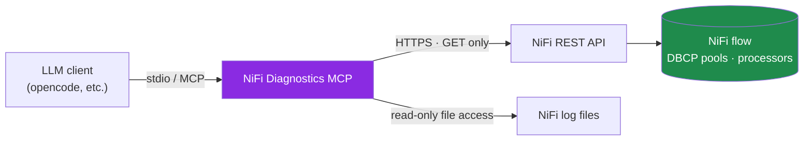

<div align="center">

# NiFi Diagnostics MCP

**A read-only Model Context Protocol server that lets an LLM diagnose Apache NiFi — without ever touching your data or your credentials.**


</div>

---

## Why this exists

Debugging a NiFi flow usually means clicking through bulletins, DBCP pools, and gigabytes of log files by hand. This server exposes that diagnostic surface to an LLM through a handful of focused, **strictly read-only** tools — so you can just ask *"which processors are failing right now?"* or *"why is this database pool unhealthy?"* and get a grounded answer.

The design goal is **safe observability**: the assistant can *see* everything it needs to diagnose a problem, and *change* nothing.

## Highlights

- **Read-only by construction** — the HTTP layer rejects every non-`GET` request, so the server physically cannot start, stop, modify, or delete anything in NiFi.
- **Credential isolation** — the model never receives usernames, passwords, tokens, hosts, or ports. Connection details are stripped before anything reaches the LLM.
- **Focused tools** — one tool per diagnostic question, so a small local model doesn't have to guess.
- **Log-aware** — reads NiFi's log files directly from disk for historical errors, not just live bulletins.
- **Transport-agnostic client** — ships wired for [opencode](https://opencode.ai) over stdio, but works with any MCP-capable client.

## Architecture



The credentials flow from the environment **into the server only** — they are used once to obtain a session token and are never passed back out to the model.

## Tools

| Tool | What it reports |
|------|-----------------|
| `check_connection` | Connectivity / auth test; returns the NiFi version. |
| `list_databases` | All DBCP connection pools with per-pool health counts. |
| `get_database_health` | Errors for one database: the controller service plus the processors that reference it. |
| `get_flow_errors` | Processors failing **right now** from live bulletins (~5 min window). Supports `output="tree"` or `"flat"`. |
| `list_affected_processors` | Every processor that uses a given DBCP pool, each with its `RUNNING` / `STOPPED` state, plus a state summary. |
| `get_log_errors` | **Historical** errors parsed from the last *N* hours of log files. Supports `detailed=true/false`. |

## Security model

This project is meant to run against a live NiFi instance, so the safety guarantees are deliberate:

1. **No writes.** Every outbound NiFi call goes through a single request helper that allows only `GET`. Any other method is refused before it leaves the process.
2. **No credentials to the model.** `NIFI_USERNAME` / `NIFI_PASSWORD` are read from the environment and exchanged for a token internally. The model sees diagnostic data, never secrets.
3. **Redaction layer.** JDBC connection strings and other connection metadata are parsed and stripped so hosts, ports, and credentials don't leak into tool output.
4. **Logs are read-only.** Log files are opened for reading only, never modified.

> !!! Treat the environment variables below as secrets. They are intentionally kept out of version control (see `.gitignore`) — never commit real values.

## Requirements

- Python 3.10+
- Apache NiFi 2.11 with the REST API reachable (single-user + self-signed cert is supported)
- An MCP-capable client (e.g. [opencode](https://opencode.ai))

## Installation

```bash
git clone https://github.com/<your-username>/nifi-diagnostics-mcp.git
cd nifi-diagnostics-mcp

python -m venv .venv
source .venv/bin/activate          # Windows: .venv\Scripts\activate
pip install -r requirements.txt
```

## Configuration

The server is configured entirely through environment variables. Copy the template and fill in your own values:

```bash
cp .env.example .env
```

| Variable | Description | Example |
|----------|-------------|---------|
| `NIFI_BASE_URL` | Base URL of the NiFi REST API | `https://localhost:8443` |
| `NIFI_USERNAME` | NiFi single-user username (used only to obtain a token) | `admin` |
| `NIFI_PASSWORD` | NiFi single-user password | `••••••••` |
| `NIFI_LOG_DIR`  | Absolute path to the NiFi logs directory | `/opt/nifi/logs` |

You can provide these however your setup prefers: a shell profile, your MCP client's `environment` block, or a `.env` loader.

## Running

The server speaks MCP over **stdio**, so it's normally launched by your MCP client rather than by hand. To smoke-test that it imports and starts:

```bash
python -m nifi_mcp
```

It will start and wait silently on stdio (that's expected). Press `Ctrl+C` to exit.

### Using it with opencode

Add the server to `~/.config/opencode/opencode.json`:

```json
{
  "$schema": "https://opencode.ai/config.json",
  "mcp": {
    "nifi": {
      "type": "local",
      "command": ["/path/to/venv/bin/python", "-m", "nifi_mcp"],
      "cwd": "/path/to/nifi-diagnostics-mcp",
      "enabled": true,
      "environment": {
        "NIFI_BASE_URL": "https://localhost:8443",
        "NIFI_USERNAME": "{env:NIFI_USERNAME}",
        "NIFI_PASSWORD": "{env:NIFI_PASSWORD}",
        "NIFI_LOG_DIR": "/opt/nifi/logs"
      }
    }
  }
}
```

The `{env:...}` references keep real credentials in your shell profile instead of the config file.

#### Optional: slash commands

Drop markdown files into `~/.config/opencode/commands/` for one-shot diagnostics. Each command pins a single tool so a small model doesn't wander:

```markdown
---
description: List all processors affected by a given DBCP connection pool
---
Call ONLY the list_affected_processors tool with pool id $ARGUMENTS.
Report the affected processors and the RUNNING/STOPPED state summary exactly as returned.
```

Saved as `nifi-affected.md`, this becomes `/nifi-affected <pool-id>`.

## Roadmap

- [ ] `snapshot` / `verify` tools for state-preserving workflows (capture the running state of a pool's processors, then confirm it afterwards)
- [ ] A "healthy processors" view to complement the error tools
- [ ] Optional remote transport, so the server can run independently of the client
- [ ] Decouple the server from opencode-specific assumptions

## Contributing

Issues and pull requests are welcome. Please keep the read-only guarantee intact — any new tool must only ever read from NiFi or its logs.

## License

Released under the [MIT License](LICENSE).
